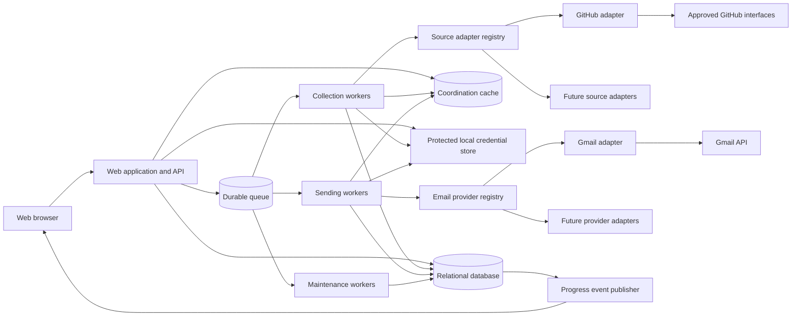
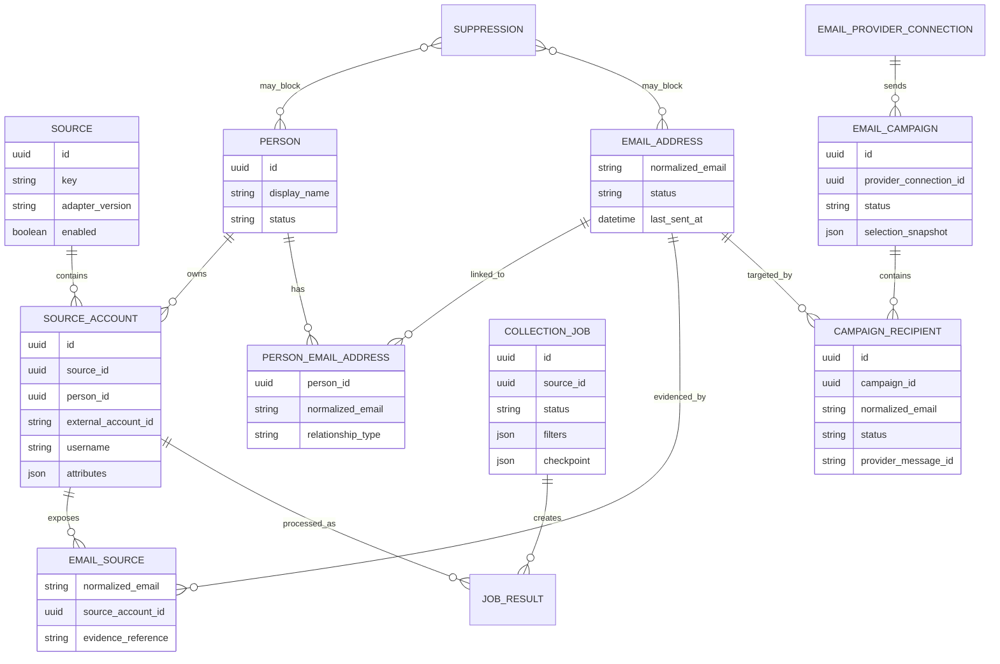
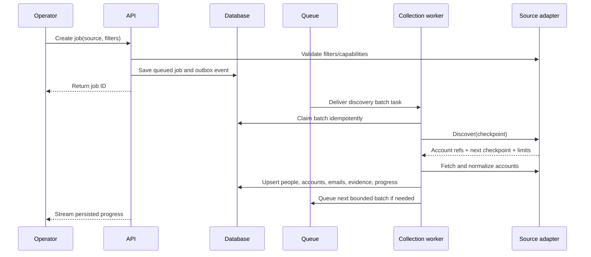
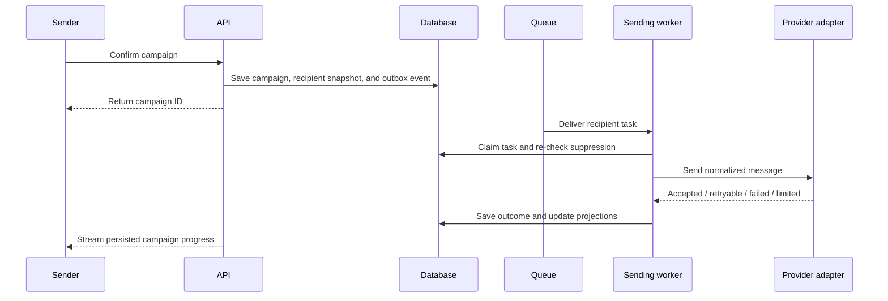

# Multi-Source Contact Collection and Email Sending — Architecture Specification

## 1. Purpose

Define an architecture for a platform that:

- Discovers public user accounts and email addresses from multiple approved websites.
- Supports source-specific filters and collection behavior.
- Normalizes records into a shared person, account, and email model.
- Runs collection jobs asynchronously with visible progress.
- Lets one trusted local operator manage collected records.
- Sends selected emails through pluggable email-provider integrations.
- Runs Gmail and GitHub as the only production adapters in the first release without making either one a permanent platform dependency.

This document governs the boundaries shared by [github_spec.md](./github_spec.md) and [EMAIL_SENDING_SPEC.md](./EMAIL_SENDING_SPEC.md).

## 2. Architectural principles

1. **Source-neutral core:** shared services never call GitHub directly or interpret GitHub response fields.
2. **Adapter-owned integrations:** every external website and email provider is isolated behind a versioned adapter contract.
3. **Normalized plus source-specific data:** stable common fields are queryable relational columns; uncommon source fields remain namespaced attributes with provenance.
4. **Asynchronous side effects:** collection and sending execute through durable queues, not HTTP request handlers.
5. **Idempotency by default:** duplicate queue delivery, retries, and worker restarts must not duplicate stored accounts or sent messages.
6. **Incremental persistence:** progress and results are stored continuously.
7. **Conservative identity resolution:** accounts are not merged merely because names or usernames resemble each other.
8. **Policy at every boundary:** suppression, rate limits, and source/provider rules are enforced centrally and again immediately before side effects.
9. **Horizontal scalability:** stateless APIs and independently scalable worker pools.
10. **Observable operations:** every job, batch, adapter call, and send can be traced without logging secrets.

## 3. Recommended deployment shape

Start with a Docker Compose deployment on the operator's local machine: a modular monolith for the API and domain logic plus separate worker processes. Bind the web interface to loopback by default. This keeps transactional rules understandable while allowing collection and sending capacity to scale independently. Modules can become separate services later if measured load requires it.



Logical separation is mandatory even when modules share a codebase or runtime.

## 4. Major components

### 4.1 Web application

- Local single-operator interface without application login or roles.
- Collection filters and job creation.
- Job and campaign monitoring.
- User, source-account, and email management.
- Campaign composition and recipient selection.
- Source and provider settings.
- Server-Sent Events client, with polling fallback.

The browser never receives source tokens, Gmail refresh tokens, or secret references.

### 4.2 Application API

- Validates requests received through the local application boundary.
- Validates source capabilities and filters through the registry.
- Creates collection jobs and email campaigns.
- Resolves filtered recipient selections into snapshots.
- Provides paginated management and status endpoints.
- Applies suppression and send-eligibility rules.
- Writes audit events for sensitive actions.
- Publishes work only after associated database state is committed.

### 4.3 Collection orchestrator

- Converts a collection job into discovery and profile batches.
- Loads the requested source adapter and its saved version/configuration.
- Persists adapter checkpoints.
- Applies global and per-source concurrency controls.
- Normalizes adapter output through the identity/persistence service.
- Updates job counters and structured events.

### 4.4 Source adapters

- Describe supported capabilities and filter definitions.
- Validate and translate filters into permitted source queries.
- Discover source-account references with resumable pagination.
- Fetch public profiles through approved interfaces.
- Normalize source responses into contract objects.
- Interpret source-specific rate limits and errors.
- Produce evidence and provenance metadata.

The MVP registry contains only the GitHub adapter. A mock adapter must be used in contract tests to prove that the shared core has no GitHub dependency.

### 4.5 Identity and persistence service

- Upserts sources, people, source accounts, emails, and provenance records.
- Normalizes usernames, URLs, and email addresses.
- Applies deterministic uniqueness constraints.
- Evaluates suppression before persistence.
- Produces possible cross-source identity matches for review or strict rules.
- Never merges profiles on fuzzy name, company, avatar, or username similarity alone.
- Emits record-change events for audit and projection updates.

### 4.6 Campaign service

- Creates immutable recipient-selection snapshots.
- Validates recipient eligibility and repeat-contact policy.
- Stores versioned message content and merge-data snapshots.
- Expands a confirmed campaign into durable recipient tasks.
- Maintains campaign counters from recipient outcomes.
- Controls pause, resume, schedule, and cancellation state transitions.

### 4.7 Sending orchestrator

- Claims eligible recipient tasks.
- Re-checks suppressions and policy immediately before submission.
- Renders messages safely from allowlisted merge fields.
- Applies global, provider, account, campaign, and recipient rate controls.
- Calls the selected email-provider adapter.
- Saves provider acceptance, retry, failure, or quota outcomes idempotently.

### 4.8 Email-provider adapters

- Manage provider authorization and connection health.
- Convert a normalized message into provider format.
- Submit a message with a stable idempotency context when supported.
- Return normalized provider outcomes.
- Classify authentication, quota, transient, and permanent failures.
- Report provider limit state when available.

The MVP registry contains only the Gmail adapter. Shared sending modules must not import Gmail SDK types.

### 4.9 Progress event publisher

- Reads committed job/campaign state or transactional outbox events.
- Publishes compact status updates to the subscribed local browser.
- Does not act as the system of record.
- Allows clients to reconnect and retrieve the latest persisted snapshot.

### 4.10 Maintenance workers

- Recover abandoned batches and recipient tasks.
- Reconcile job/campaign counters and denormalized table summaries.
- Refresh integration health and detect revoked credentials.
- Run bounded, rate-aware freshness checks when explicitly scheduled.

## 5. Domain model



### 5.1 Identity rules

- `source_accounts` are unique by `(source_id, external_account_id)`.
- `email_addresses.normalized_email` is the global primary key; every writer trims and lowercases the complete address, applies IDNA domain normalization, and uses an atomic upsert.
- Usernames are always source-scoped and may change.
- A normalized email can be linked to multiple source accounts through provenance.
- A person can own multiple source accounts and email addresses, and one email can be linked to multiple people through `person_email_addresses`.
- Exact shared public email does not automatically merge people.
- Conflicting or uncertain links remain separate rather than risking an incorrect merge.
- Merges and splits preserve an audit trail and source evidence.

### 5.2 Provenance rules

Every collected email or normalized field must retain:

- Source and source-account identity.
- Collection job and adapter version.
- Evidence URL or opaque API resource reference where storage is allowed.
- Source method/capability.
- First seen, last seen, and last verified timestamps.
- Public/declaration classification.

Provenance must survive deduplication so operators can determine where a value came from.

### 5.3 Source-specific attributes

- Shared fields belong in normalized columns only when they have consistent cross-source meaning.
- Adapter-only fields use a namespaced JSON attributes object validated against the adapter version's schema.
- Frequently queried adapter fields may later receive indexed projection columns without changing the adapter contract.
- Raw payload storage is optional, minimized, access-controlled, and time-limited.

## 6. Source adapter contract

A source adapter package must expose an interface equivalent to:

```text
metadata() -> SourceMetadata
capabilities() -> SourceCapabilities
filter_schema() -> FilterSchema
validate_filters(filters) -> ValidationResult
build_query(filters) -> AdapterQuery
discover(query, checkpoint, batch_limit) -> DiscoveryBatch
fetch_accounts(account_refs, request_context) -> AccountBatch
normalize(raw_account) -> NormalizedSourceAccount
classify_error(error) -> NormalizedExternalError
limit_state(context) -> LimitState | Unknown
health_check(connection) -> HealthResult
```

### Required contract objects

`SourceMetadata` includes a stable source key, display name, adapter version, and policy/configuration version.

`SourceCapabilities` declares whether the adapter supports discovery, profile fetching, public email, incremental refresh, organizations, and each common filter.

`FilterSchema` describes field types, allowed operators, bounds, help text, and whether a filter is required. The UI consumes this schema; the server remains authoritative.

`DiscoveryBatch` contains stable account references, a serializable next checkpoint, an end-of-results flag, and normalized limit metadata.

`NormalizedSourceAccount` contains source identity, common profile fields, email observations, adapter attributes, provenance, and source timestamps. It contains no database models.

### Adapter isolation rules

- Adapters cannot directly update shared domain tables.
- Adapters cannot enqueue arbitrary jobs or send email.
- Adapters access secrets through opaque references and a restricted integration context.
- Adapter network targets are allowlisted per source in production where feasible.
- Adapter versions are recorded on jobs and evidence records.
- Breaking contract or normalization changes require a new adapter version and migration strategy.
- Enabling a new source requires policy, security, rate-limit, and data-mapping review.

## 7. Email-provider adapter contract

An email-provider adapter must expose an interface equivalent to:

```text
authorization_metadata() -> AuthorizationMetadata
complete_connection(callback_data) -> ProviderConnectionResult
health_check(connection_ref) -> HealthResult
sender_identity(connection_ref) -> SenderIdentity
send(message, connection_ref, idempotency_context) -> SendResult
classify_error(error) -> NormalizedProviderError
limit_state(connection_ref) -> LimitState | Unknown
disconnect(connection_ref) -> DisconnectResult
```

`SendResult` distinguishes accepted, rejected permanently, retryable, authentication failure, and provider limited. An accepted result includes provider identifiers and timestamp but does not imply delivery.

The Gmail adapter owns OAuth details, MIME/base64 encoding, Gmail request objects, Gmail error mapping, and returned Gmail IDs. Shared campaign logic sees only normalized objects.

## 8. Collection processing flow



### Collection idempotency

- A unique job/batch key prevents concurrent duplicate batch processing.
- Account upsert uses source-scoped external identity.
- Email/evidence upserts use normalized deterministic keys.
- Checkpoint advancement and saved results occur atomically where practical.
- If external calls succeed but persistence fails, replaying normalization/upserts is safe.

## 9. Sending processing flow



### Sending idempotency

- Each campaign/email pair has a durable unique recipient task.
- Each provider submission has a stable idempotency context.
- A task already marked sent is never submitted again.
- Ambiguous timeouts enter reconciliation rather than immediate blind retry.
- Provider IDs and acceptance timestamps are stored before completion is reported.

## 10. Queue and worker topology

Use separate logical queues for:

- Collection discovery.
- Collection profile fetching/normalization.
- Campaign expansion.
- Email sending.
- Reconciliation and maintenance.

Queue requirements:

- Durable at-least-once delivery.
- Delayed delivery for retry/backoff and scheduling.
- Visibility timeout or leases with renewal.
- Dead-letter handling after bounded attempts.
- Per-source and per-provider concurrency/rate controls.
- Priority lanes so one large job cannot starve all other work.
- Payloads contain internal IDs and versions, not credentials or large raw profiles.

Workers are stateless apart from bounded in-memory batch data. Scaling one worker pool must not require scaling every other pool.

## 11. Transactional consistency

- Use database transactions for state transitions and related counters where possible.
- Use a transactional outbox to publish queue and progress events after database commit.
- Treat the relational database as the system of record; queue and cache state are disposable/rebuildable.
- Derive denormalized counters and last-sent table columns from authoritative detail rows.
- Run periodic reconciliation to correct projections and recover expired task leases.
- Use optimistic versioning or compare-and-set transitions to prevent invalid concurrent job/campaign actions.

## 12. Rate limiting and fairness

Apply hierarchical token buckets or an equivalent mechanism:

- Platform-wide.
- Per tenant/organization if multi-tenancy is introduced.
- Per external source.
- Per source credential.
- Per email provider.
- Per connected sender account.
- Per campaign.

Adapters translate external limit signals into normalized limit state. Orchestrators decide when tasks may be claimed again. Limits and next-resume times are stored so restarting workers does not cause a request burst.

Fair scheduling should allocate bounded batches across jobs and campaigns rather than draining one large workload before all others.

## 13. API and UI scalability

- All tables use cursor or bounded server-side pagination.
- Filter and sort fields are allowlisted and indexed.
- Large select-all operations create asynchronous selection snapshots rather than transferring every ID through the browser.
- Progress endpoints send compact deltas and allow snapshot recovery after disconnect.
- Expensive counts may use maintained projections rather than full-table scans.
- API nodes remain stateless; the local MVP has no application sessions.

## 14. Database scalability

Start with one relational database and design for growth:

- UUID or another globally safe internal identifier.
- Source-scoped uniqueness constraints.
- Composite indexes aligned with worker claiming and management filters.
- Partition high-volume append-only tables such as events, audit logs, and campaign recipients when measured size warrants it.
- Use short transactions and skip-locked/lease-based task claiming where supported.
- Keep unrestricted raw payloads out of hot relational rows.
- Introduce read replicas only when observed read load requires them; never serve state-transition decisions from stale replicas.
- Keep MVP records until explicit manual deletion; do not add automatic archival or expiry jobs.

## 15. Caching and coordination

A cache/coordination store may hold:

- Distributed rate-limit counters.
- Short-lived worker leases.
- Progress-publish fan-out.
- Capability/filter-schema cache.
- Short-lived query result cache for dashboards.

It must not be the only copy of job checkpoints, recipient status, suppressions, audit events, or provider acceptance data.

## 16. Security boundaries

- Source and provider credentials live in a protected local credential file or dedicated encrypted store, never generic settings JSON.
- Workers receive the narrowest credential reference required for their adapter call.
- The web server binds to loopback by default; non-loopback startup warns that the MVP has no authentication and must not be exposed to an untrusted network.
- Suppression is a shared core service, not optional adapter behavior.
- External profile text and HTML email content are untrusted and sanitized for their output context.
- Adapter outbound network access is constrained to approved endpoints where deployment supports it.
- Linked-website fetching blocks private/local addresses, DNS rebinding, cross-domain redirects, oversized responses, authentication, and form submission.
- Logs redact authorization data, full message bodies, and unnecessary personal data.
- Sensitive actions and settings changes create immutable audit events.
- Encryption keys, application secrets, source credentials, and provider credentials have separate rotation paths.

## 17. Privacy and manual deletion architecture

- Store only fields necessary for the documented purpose.
- The MVP applies no automatic retention expiry; stored data remains until explicit manual deletion.
- Suppression records survive ordinary deletion in privacy-preserving form where necessary to prevent recollection or re-contact.
- A deletion workflow traverses person, source account, email, provenance, campaign snapshot, cache, and search projections.
- Historical operational records should be redacted or irreversibly pseudonymized when they no longer need direct identifiers.
- Backups are operator-managed; documentation warns that deleting live records does not delete separately created backups.
- Adding a source or provider requires documenting its data flows and deletion behavior.

## 18. Observability

### Logs

- Structured JSON or equivalent.
- Correlation IDs for request, job, batch, source account, campaign, recipient task, and adapter call.
- Normalized error category plus safe adapter error reference.
- No tokens, authorization headers, unrestricted raw payloads, or complete message content.

### Metrics

- Queue depth and oldest-task age by queue.
- Worker throughput, lease expiry, retry, and dead-letter counts.
- Discovery and profile-fetch rate by source.
- External latency, status category, and limit waits by adapter.
- Persistence/upsert latency and conflict counts.
- Campaign submission success, retry, failure, and provider-limit rate.
- Active browser progress connections and publish lag.

### Tracing

Distributed tracing should connect API requests, outbox publication, queue delivery, adapter calls, and database transitions while applying privacy-safe attribute rules.

## 19. Failure handling

- **Source unavailable:** preserve checkpoint, back off, show degraded source health, and resume later.
- **Source credential revoked:** pause affected jobs and require reauthorization.
- **Provider credential revoked:** stop sends for that connection; do not fail unrelated connections.
- **Rate limit reached:** delay affected tasks using normalized reset information.
- **Worker crash:** lease expires and another worker resumes the idempotent task.
- **Queue duplicate:** unique batch/recipient key turns delivery into a no-op or safe resume.
- **Database unavailable:** do not acknowledge queue tasks or report completion.
- **Progress channel unavailable:** work continues; clients fall back to polling persisted state.
- **Poison record:** isolate it after bounded retries and let the rest of the batch continue.
- **Ambiguous email-send timeout:** reconcile before any retry that could duplicate a message.

## 20. Adding a new collection source

1. Complete policy, legal, privacy, and security review.
2. Define source metadata, capabilities, filter schema, and credential needs.
3. Implement the source adapter contract without importing application database models.
4. Map source data into normalized account, email observation, and provenance objects.
5. Define rate-limit and error classification.
6. Add adapter contract, checkpoint/resume, idempotency, and fixture-based normalization tests.
7. Verify the shared UI can render the filter schema and display source-specific attributes safely.
8. Register the adapter disabled by default.
9. Run limited-volume staging and production canaries.
10. Enable it through configuration and monitor source-specific metrics.

No shared collection-job table or management-page rewrite should be necessary.

## 21. Adding a new email provider

1. Complete provider policy, security, deliverability, and privacy review.
2. Implement authorization, connection health, send, normalized error mapping, and limit reporting.
3. Add idempotency and ambiguous-timeout handling appropriate to the provider.
4. Add contract tests using the same campaign scenarios as Gmail.
5. Register the provider disabled by default.
6. Verify shared campaign status and email-table projections require no provider-specific branches.
7. Enable it through configuration with conservative limits.

No campaign-recipient table change should be necessary solely to add a provider.

## 22. Testing strategy

### Unit tests

- Filter and capability validation.
- Normalization and deterministic keys.
- Identity merge/split rules.
- Suppression at collection and send boundaries.
- State machines and local-boundary request validation.
- Message rendering and header/HTML safety.
- Adapter error normalization.

### Contract tests

- A shared suite every source adapter must pass.
- A shared suite every email-provider adapter must pass.
- Checkpoint serialization compatibility.
- Rate-limit and retry behavior.
- No provider/source SDK types crossing adapter boundaries.

### Integration tests

- Database constraints and transactional outbox.
- Queue duplicate delivery and worker crash recovery.
- Progress snapshot plus reconnect.
- Selection snapshot consistency.
- Gmail and GitHub sandbox/fixture paths without uncontrolled live external calls.

### End-to-end tests

- Create GitHub job, collect fixture users/emails, and inspect results.
- Select results, create Gmail campaign, send through a controlled test account/adapter, and verify sent projections.
- Pause, resume, cancel, suppress, delete, revoke credentials, and recover workers.
- Register dummy second source and provider adapters to prove extensibility.

### Load tests

- Many simultaneous jobs with fair scheduling.
- Large source-account and email tables with filtered pagination.
- Large select-all snapshot creation.
- Sustained worker throughput under source/provider limits.
- Progress fan-out without excessive database polling.

## 23. Suggested implementation modules

Names are illustrative and technology-neutral:

```text
application/
  collection/
    domain/
    orchestration/
  contacts/
    identity/
    persistence/
    suppression/
  campaigns/
    domain/
    orchestration/
    rendering/
  integrations/
    sources/
      contract/
      github/
    email_providers/
      contract/
      gmail/
  jobs/
    queue/
    outbox/
    progress/
  audit/
  web/
```

Dependency direction must point from adapters toward contracts and from delivery mechanisms toward domain services. Shared domain modules must not depend on GitHub or Gmail packages.

## 24. Delivery stages

### Stage 1 — Foundation

- Local modular application/API, database, durable queue, transactional outbox, audit, and protected credentials.
- Source and provider contracts plus registries.
- Mock adapters and contract test suites.

### Stage 2 — GitHub collection

- GitHub adapter.
- Collection orchestration, normalized contact storage, progress, and management UI.
- Suppression, manual deletion, and reconciliation basics; no export or automatic retention subsystem.

### Stage 3 — Gmail sending

- Gmail adapter and OAuth settings.
- Selection snapshots, campaigns, recipient workers, progress, and sent-status projections.
- Conservative rate limits and abuse-prevention controls.

### Stage 4 — Scale validation

- Load tests, worker autoscaling rules, partition/index review, alerts, and runbooks.
- Implement a dummy or real second source and provider to validate boundaries.

### Stage 5 — Additional integrations

- Enable further sources/providers one at a time after their required reviews and canaries.

## 25. Architecture acceptance criteria

1. GitHub API types and logic exist only in the GitHub adapter package.
2. Gmail API types and logic exist only in the Gmail adapter package.
3. Shared jobs reference `source_id`; shared campaigns reference `provider_connection_id`.
4. Adding a contract-compliant dummy second source requires no shared schema or orchestration changes.
5. Adding a contract-compliant dummy second email provider requires no campaign schema or orchestration changes.
6. Collection and sending run in separate horizontally scalable worker pools.
7. Duplicate queue deliveries do not duplicate source accounts, evidence, or successful email submissions.
8. Job/campaign progress remains recoverable after API, progress-channel, or worker restart.
9. Source/provider rate limiting affects only the relevant credential or integration wherever possible.
10. Suppression is checked during collection persistence, campaign selection, and immediately before sending.
11. Every stored email retains source provenance after deduplication.
12. Every successful send retains campaign, recipient, sender connection, provider ID, and acceptance timestamp.
13. Management tables can filter across sources without adapter-specific queries in the UI.
14. Secrets never enter queue payloads, browser responses, generic JSON settings, or logs.
15. The MVP binds to loopback, requires no application login, and provides no export or automatic-retention subsystem.
16. One globally unique email can be linked to multiple people without merging those people.

## 26. Open architecture decisions

- Will source/provider adapters ship in-process or as separately deployable services?
- Which transactional outbox and worker-lease pattern best matches the selected database/queue?
- Which website and email provider are likely to be second, so contracts can be validated against realistic differences?
- Which cross-source identity matches may be automatic, and which require manual review?
